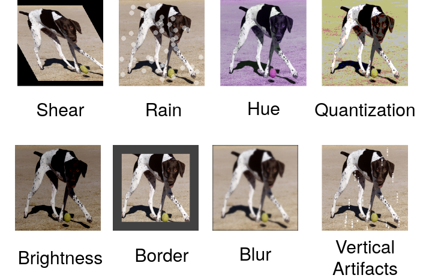

# Increasing the Coverage and Balance of Benchmarks by Using Non-Overlapping Corruptions
This repository contains the code associated with the paper entitled [Increasing the Coverage and Balance of Benchmarks by Using Non-Overlapping Corruptions](https://linktothepaper)
In this paper a new benchmark called NOCS is proposed. This benchmark evaluates the robustness of image classifiers towards common corruptions.
NOCS is based on eight image transformations that have been chosen to cover a very large range of diverse common corruptions. Here is the illustration of the NOCS corruptions:

## Requirements
Pytorch 1.5

scipy 1.4

pandas 1.0

## Test the Robustness of a Model to NOCS
To get the NOCS CE scores of a standard pretrained ResNet-50, launch the following command:

`python3 get_mCE.py PATH_TO_THE_VAL_SET_FOLDER`

With PATH_TO_THE_VAL_SET_FOLDER the path to the ImageNet validation set.

The code can be adapted to load your own model instead of a standard ResNet-50.

## Performances of Various Models to NOCS
We provide the NOCS CE scores of several pretrained torchvision models.

| Model | mCE     |
| :------------- | :------------- |
| AlexNet       | 100       |
| :------------- | :------------- |
| SqueezeNet      | 106       |

| Model     | Paper    | mCE   |
| :------------- | :------------- | :------------- |
| Item One       | Item Two       | Item Three     |

## Citation

    @article{bibkey:laugros2020inoc,
      title={},
      author={},
      journal={},
      year={}
    }
