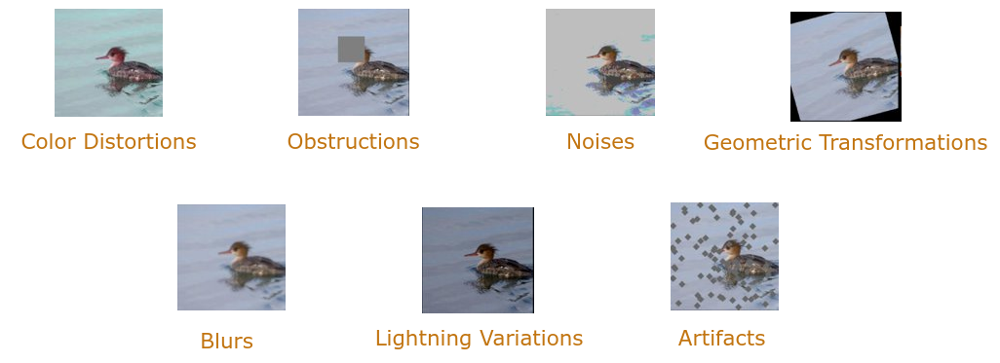
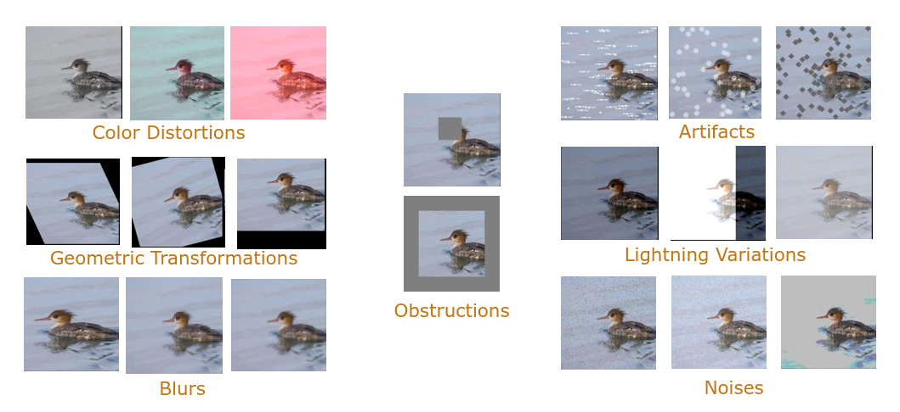

#An Optimal Benchmark to Estimate the Robustness of Image Classifier#
We propose a benchmark that evaluates the robustness of image classifiers towards the seven major kinds of commonly encountered corruptions.

##Requirements##
Pytorch 1.5
scipy 1.4
pandas 1.0

##How to Use the Benchmark##
We provide a basic example on how to estimate the robustness of an ImageNet classifier with the benchmark.
This code can be adapted to your need by using your own test set and your own classifier constructor.
The test can be launched with the following command:
`python3 get_mCE.py PATH_TO_THE_TEST_SET_FOLDER`

We use the mean CE metric to evaluate the robustness of neural networks.
The more the CE scores are close to 0 the more the tested models are robust.
A CE score of 100 means that the tested model is as robust as the pretrained pytorch resnet-50 towards the considered common corruption.
Additional information about the mCE metric can be found [here](https://arxiv.org/pdf/1903.12261.pdf).

All the corruptions can be used in any other testing procedure that uses a pytorch dataloader.
Then, the corruptions can be used in a preprocessing chain `torchvision.transforms.Compose` as shown in the following code line:
`torchvision.transforms.Compose([torchvision.transforms.ToTensor(),CC_Transform(corruption_amount,name_of_the_corruption)])`

##Additional Corruptions##
In addition to the corruptions provided in the optimal benchmark, we implemented some additional corruptions that are displayed below.
These corruptions are accessible in the file CC_Transform.py.

